# Tweets Sentiment Analysis for Covid19 -- CS 205 Final Project

#### Names: Weiru Chen, Wanxi Yang, Lyu Zhao, Shuyuan Xiao

## Problem Statement

Coronaviruses are a group of viruses that could cause illness in humans and some animals. The COVID-19 disease is defined as an illness that is caused by severe acute respiratory syndrome coronavirus 2. On March 11th, 2020, WHO declared the coronavirus a global pandemic, signaling its first such designation since the declaration of H1N1 influenza as a pandemic in 2009. There are more than 1 million confirmed cases in the U.S, and more than 3 million confirmed cases around the world, and those numbers are rapidly growing.

How do people cope with this pandemic? What is the general attitude towards the coronavirus? To understand how people describe the coronavirus, we want to analyze textual data that are related to coronavirus and observe the trend of emotions and the topics people talk about in general.

## Solution & Existing Work

Our project aims to use data on Twitter to analyze people’s attitudes towards coronavirus. Twitter is a social media full of people’s textual description of their emotions and the events happened in life. We obtained a dataset on coronavirus and performed sentiment classification on them. In our project, we mainly focus on Naive Bayes and Random Forest models and use multithreading methods to accelerate the analyzing process.

  

Twitter sentiment analysis is a common form of data analysis as Twitter is one of the most easily-obtained data sources. There exist many works on different ways of analyzing tweets with a diverse selection of models. These previous projects often focus on experimenting with new algorithms for performing sentiment analysis. Our work is distinct from the existing work in the following ways:

1. We focus specifically on tweets that involve Covid-19

2. Our dataset is relatively large compared to other mini-dataset used for sentiment analysis

2. We pre-process the data using Spark.

3. We take advantage of multiprocessing and implement that into our Naive Bayes and Random Forest models.

Our project requires multi-processing because

1. Big data: we have a relatively large datasets

2. Big compute: the models we use can benefit from multi-processing

3. Using multi-processing for natural language processing is fairly uncommon, we want to use this opportunity to explore this area.

## Data

The main datasets we used in the project are collected from Twitter. Because the Twitter developer’s account’s application process takes much longer during the pandemic, we ultimately used a tool called GetOldTweets3 to scrape the Twitter information. The csv contains 11 columns: id (str), permalink (str), username (str), to (str), text (str), data (datetime) in UTC, retweets (int), favorites (int), mentions (str) hashtags (str), and geo (str). The queries are constricted to the English language using the option --lang en.

  

There are two main datasets. The first data set consists of about 1,6000 tweets that include “coronavirus” on May 2nd, 2020. The second data set consists of about 10,000 tweets that include “coronavirus” from May 2nd to May 8th 2020. Because Twitter tends to limit API’s visits, these are not the complete tweets that include “coronavirus.”
 

Because we did not tag the sentiment of the tweets we collected, we used two other Twitter datasets as our training material. For the Naive Bayes model, we used the Sentiment140 dataset on Kaggle for training. For the Random Forest model, we used the Twitter Airline Sentiment dataset on Kaggle for training.

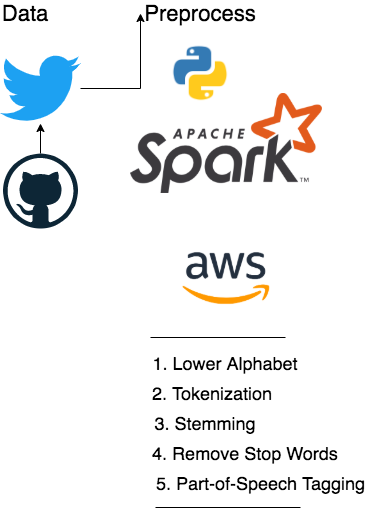

## Technical Description
- Random Forest Model:
  - Programming language: Python 3.7.4
  - Python libraries: 
    - Numpy, Pandas, re, nltk, sqlite3, sklearn, gensim, collections, sys 
    - csv, multiprocessing, threading, random, time, itertools, textblob 
  - PySpark libraries: 
    - pyspark.sql, pyspark.ml, pyspark.mllib 
  - PySpark environment (see performance evaluation for more information): 
    - AWS EC2 environment 
    - Ubuntu 16.04 
    - m4.xlarge instance 
 
## Model
### Naive Bayes Model:
Previously we have seen how the Bayes model will help us in sentiment analysis using prior and posterior. Before calculating any probabilities for posteriors, we need to first preprocess our data as they are not numerical data type. Overall we are only interested in the sentiment, users’ attitudes, and text, users’ tweets. Therefore, we group sentiments into three categories: positive, neutral and negative. Moreover, we apply the bag of words (BOW) to text. That is, we map each text into a list of strings, and therefore we can calculate priors and posteriors based on appearances of strings. This will definitely be a big dataset that grows even more with time. Further, timely feedback is necessary in dealing with sentimental problems since we are interested in how users’ attitudes change. So the task would fail if feedback can not be generated in a timely manner, possibly due to slow process in processing and digesting the huge dataset. Note that ordering is not required in BOW, so we could optimize priors and posteriors calculations in Bayes model.

To run Bayes, we need to have priors set up by training data, where we record the probability of each word appearing. Then in the prediction method, we will use these priors for posteriors. (TODO: May add formula to show how Bayes works) Again, no ordering is needed here, so we could apply multiprocessing, specifically pool method, to update posteriors of positive, neutral, and negative text by testing data.

In our code, we have applied Bayes to a sample of size 100,000 out of 1.6 million tweets, 80% for training and 20% for testing. We achieved 83% accuracy overall in the Bayes model, and we will apply this trained Bayes model to predict fresh tweets lately to see users’ attitudes with time varying. This gives the number of positive and negative tweets given different dates in May.

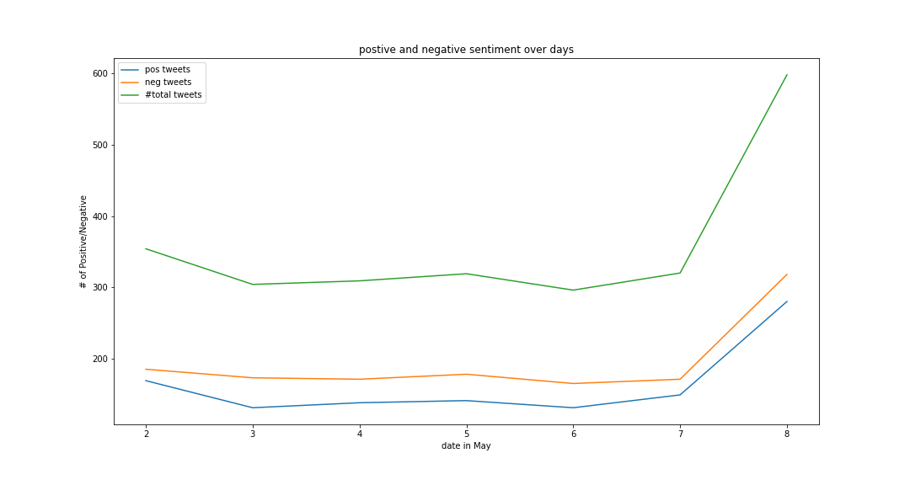
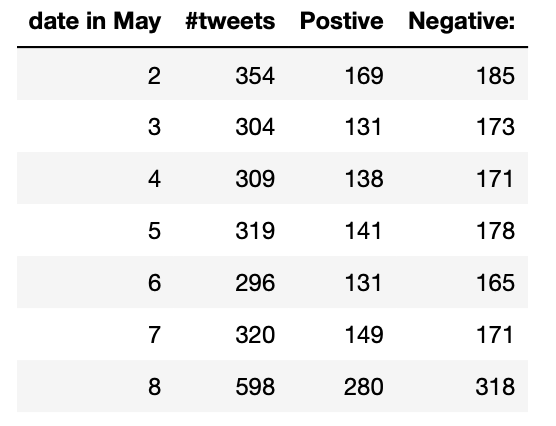

We can see that the number of negative tweets are all greater than that of positive tweets during these days. It is not surprising as we see many concerns coming with COVID19 these days. Moreover, it is worth noticing that the number of total tweets overall is increasing over time, so simply checking the difference between the number of positive and negative tweets would be somehow biased. It would be interesting to ask how much these concerns and negative tweets result from COVID19, how positive tweets connect with development of COVID19 updates, and other questions developing over time specifically convolved with COVID19 timely updates.

### Random Forest Model:

Before the implementation of the random forest model, we need to preprocess the text data of tweets and convert them into numerical data. Here we use TF-IDF (Term Frequency Inverse Document Frequency) method to convert the text data into numerical vectors. This process can be parallelized by using MapReduce and Multiprocessing. And the performance of these parallelization methods will be discussed in later sections.

We used the random forest model to train and classify the twitter-airline-sentiment tweets into positive, neutral, and negative. Then we used this model to predict the sentiments of coronavirus related tweets. The overall accuracy score of the random forest model is around 0.9379. The confusion matrix of the results is shown as follows:

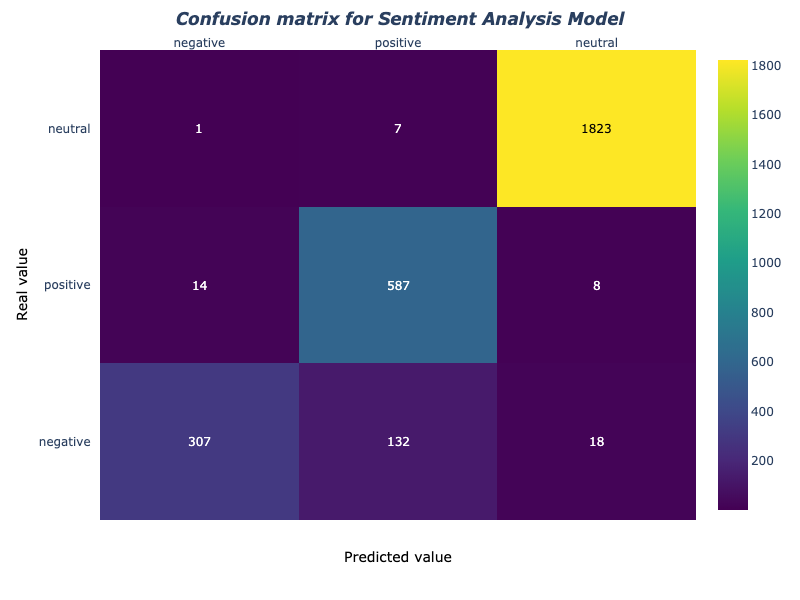

We can see that the performance of this random forest model is relatively high and the imbalanced data does not lead to highly biased predictions. We have also used the random forest model from a library in PySpark, but the accuracy rate is not as high as this model. So we use this model for future sentiment predictions.

While the random forest model is implemented by hand and the dataset is quite large, it takes extremely long time to train the algorithm and make predictions and evaluations. So parallel computing can be applied in this process in order to reduce the program run time. Here we mainly use the Multiprocessing module in Python for parallelization, and Multithreading is also used in some functions to further reduce the run time. The performance of these two parallelization methods will also be discussed in later sections.

After the evaluation of this random forest model, we save this model and use it to predict the sentiments of the 16900 coronavirus related tweets scraped from Twitter. The predicted results is shown in the following plot:

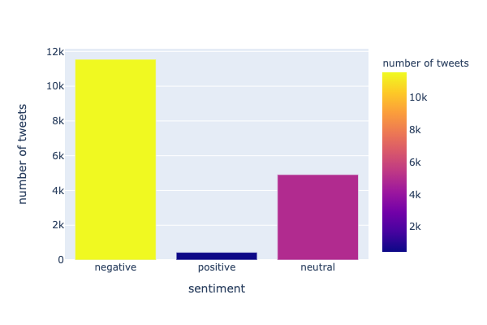

We can see from the plot that the number of tweets that are predicted as negative is the highest, while the number of tweets predicted as positive is the lowest. 

We also predicted the sentiments of another dataset with 114496 coronavirus related tweets scraped from Twitter. The predicted results is shown in the following plot:

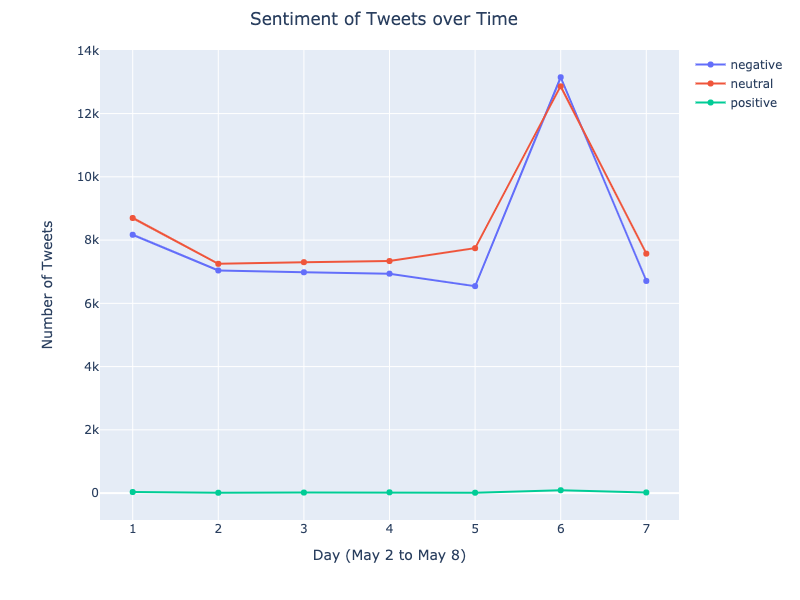

From this plot we can see that for this larger dataset, the number of tweets that are predicted as negative is slightly lower than the number of tweets predicted as neutral and is much higher than the number of tweets predicted as positive over time (from May 2nd to May 8th). 

## Performance Evaluation
### Naive Bayes Model
We have discussed why we can apply multiprocessing to help us speed up our Bayes model. We used the Pool function here to give an optimal number of processes needed for prior and posterior calculations. This optimal number greatly depends on the number of samples, i.e. the number of tweets we want to calculate for predictions. Therefore, we set the number of samples as the independent variable, and time spent as dependent variable. Specifically, we recorded the serial time, the time spent when running the predictions in serial, and the parallel time, the time spent when we applied multiprocessing as optimizations to run the predictions in parallel. Here is the time plot.

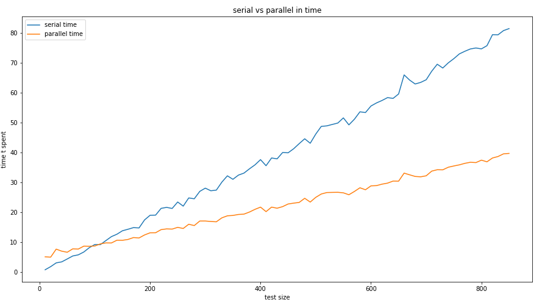

Having this, we can further see the speedup, the ratio of parallel time to serial time.

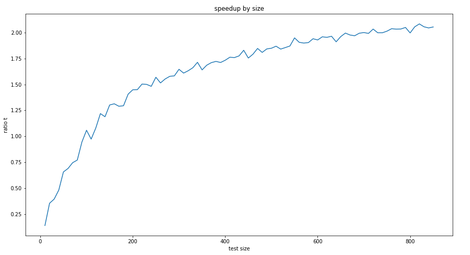

### Random Forest Model
The original run time of the serial version of TF-IDF function is around 11.25 seconds. After using mapper, reducer, and multiprocessing (with 4 cores) methods, the run time has largely decreased to around 7.11 seconds. The breakdown of the run time is shown in the following pie chart:

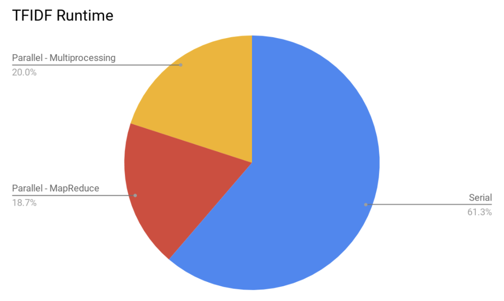

The MapReduce method is used for computing the values of document frequency, and the Multiprocessing method is used for computing the values of term frequency inverse document frequency after mapper and reducer. The run time of these two programs is very close, which is over 3 seconds. The exact serial runtime and parallel runtime used is presented in the following two tables:

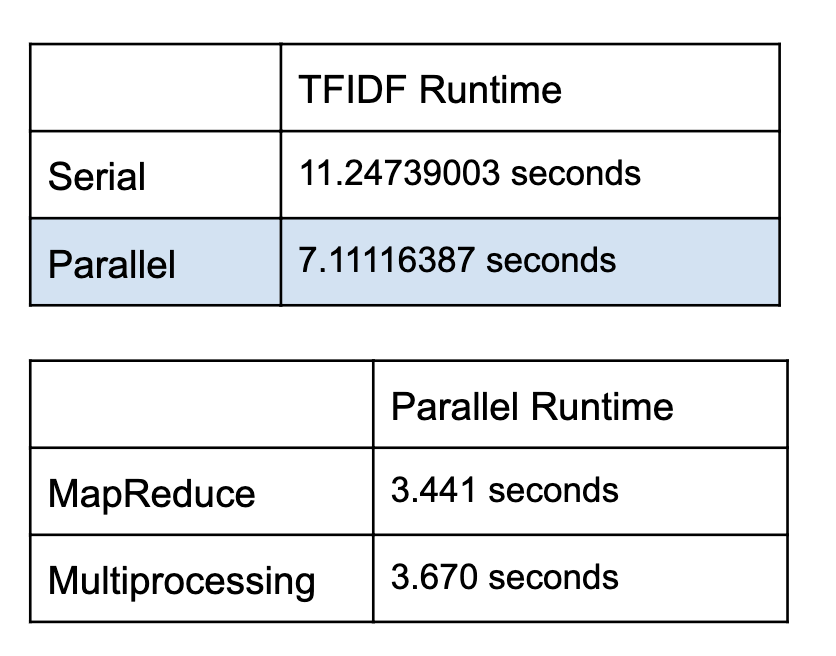

We also have a larger dataset with 114496 coronavirus related tweets. If computing the values of TF-IDF using this dataset, the run time would reduce from 71.24 seconds to 31 (mapreduce)+29.15 (multiprocessing) = 60.15 seconds.

For the random forest model we use both multiprocessing and multithreading methods for parallelization, with multiprocessing as the main method. We experiment with k=1,2,3,4 cores and n=1,2,3,4 threads to compute the run time of the program and compute the speedups. The speedups for the multiprocessing method is shown in the following plot:

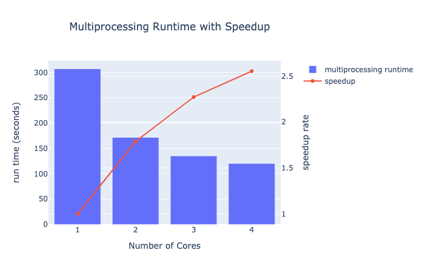

For the multiprocessing method, we randomly sampled 10 percent of the original dataset for the training process to reduce the experimentation time. From the plot we can see that the runtime has been decreasing as the number of cores increases, while the decreasing rate is slowing down. And the speedup is the highest when there are k=4 cores. In our experimentation, we also found that the runtime has been increasing when the number of cores is larger than 4. Therefore, the speedup is optimized when the number of cores equals to 4, which is around 2.5.

The speedup for the the multithreading method is shown in the following plot:

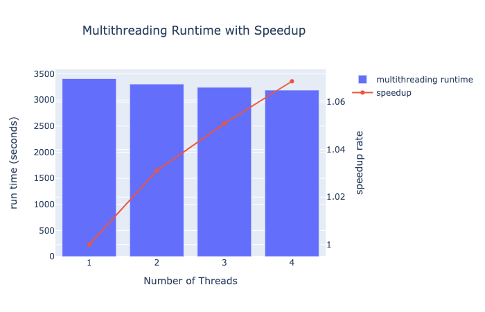

For the multithreading method, we use the whole original dataset for the training method, while we use the multiprocessing method in addition to reduce the runtime. And we choose the optimized k=4 cores for this experiment. As the multithreading method is only used in the data sampling function in the random forest classifier, the speedups in this experiment are not very high and are only roughly greater than 1. But we can still see the trend that the run time is decreasing when the number of threads is increasing. The speedup is the highest when there are 4 threads and the optimized speedup is around 1.07.

In addition, we also used the random forest model from the pyspark.ml.classification library in PySpark. We experimented in Spark local mode with k=1,2,3,4 cores. This experiment is done in AWS EC2 environment with Ubuntu 16.04 and m4.xlarge to enable the evaluation of parallel implementation. The speedup is shown in the following plot:

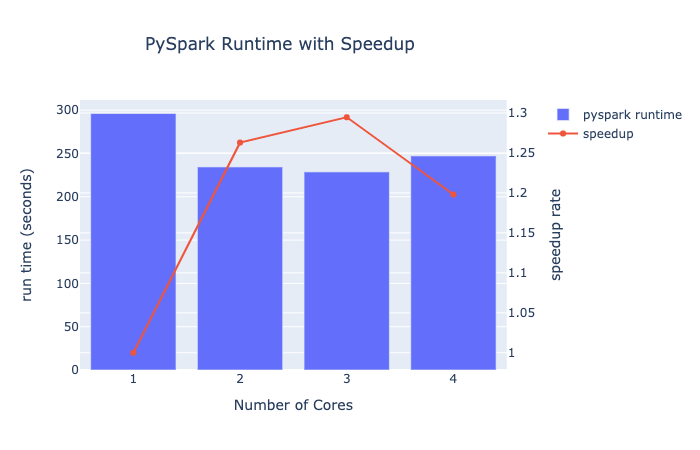

For the random forest classifier in PySpark library, the runtime first decreases and then increases with increase in the number of cores. The speedup first increases and then decreases and the maximum speedup is achieved when the number of cores equal to 3. Therefore, the optimized number of cores for the random forest classifier in PySpark is 3. While the accuracy rate of this model is lower than the overall accuracy rate of the random forest algorithm implemented by us with some random sampling of data, we didn’t use this random forest classifier to predict the sentiments of coronavirus related tweets.

## Analysis
### Overhead
  -In Random Forest and Naive Bayes, the order doesn’t matter. If using OpenMP, data transferring and communication would take some time and could not be parallelized. Those would be the overhead. 
Data Loading is a linear process and would need to be serial.
### Numerical Complexity
- Naive Bayes Model was divided into two parts: 
      - 1.1 map attitude to string: O(n)
      - 1.2 map text to BOW: O(n^2)
  - In general, the complexity of Naive Bayes algorithm is O(nK), where n is the number of features extracted and K is the number of classes. 
  - Speed-up happens in both processes.
- Random Forest Model:
    - 1.1 Data import: O(n)
    - 1.2. TF-IDF: The numerical complexity of the TF-IDF algorithm is O(nL*lognL), where n is total number of sentences in corpus, and L is the average length of the sentences.
    - 1.3. Training a random forest has a complexity of O(v * nlog(n)), where n is the size of the data, and v is the number of features. 
    - 1.4 Model prediction takes O(k), where k is the size of the test/validation set. 
  -Speed-up happens in step 1.2 and 1.3.

## Discussion
### Goals Achieved
The goal of our project is to analyze the textual contents of people’s tweets on Twitter to understand their attitudes and thoughts towards coronavirus. Our models learn to make predictions with the tweets and can tell how people feel about the topic. Although there are some minor defects, the models nicely achieved our goal. 

### Improvements Suggested
The implementations of the two models are already very nice, and the performance is fairly satisfying. However, if we were to suggest some further improvements to make the models even better. They would be as follows. The two models are using different dataset because of the tags and stop word issue. And while the labels of the random forest model can be positive, negative, or neural, the labels of the naive bayes model can only be either positive or negative. Two models are using different word representations. (But this can also be viewed as a way to explore the effect of different embedding method)  

### Lessons Learnt
Multiprocessing and multithreading are very powerful tools when applied to real-world computation, and they could achieve great speedup. And they could be combined with map reduce. It is a very good practice to use map reduce to process the data needed, and then apply multiprocessing and multithreading to the models and computations. This combination can boost performance by a fair amount. 

### Future Work
There are a lot of future work that could be done to further exploit this topic. 
- Build CNN or RNN (LSTM with/without attention) to classify the attitudes of the texts.
- Try to relate the attitudes of the tweets to more specific events, topics, or figures by the key words search in the textual contents.
- Instead of having only positive, negative, and neural for labels, we could further divide the labels into numerical degrees to evaluate how positive or how negative the tweets are.

### Interesting Insights
In the Random Forest Model, we used a TextBlob to identify sentiment from the contents of the tweets, and it will predict a label that is positive, neural, or negative.
The model identified many negative tweets as positive (false positive)
Most of the historical and current tweets are identified as positive, which is highly unlikely at this point. As this is a consistant midstake, it might be due to some structural error and midunderstanding of the models. This could be further exploited. 

## Conclusion
Both Naive Bayes model and the Random Forest model have satisfying performance, with respectively 0.83 and 0.9379 accuracy (correctly classfied labels). The Naive Bayes model achieved parallelization by applying multiprocessing (pool method) in priors and posteriors, and the random forest utilized multiprocessing, multithreading, and map reduce in realize TF-IDF convertion. They both achieved reasonable speedups. 

The two models have their own pros and cons. For the Naive Bayes model, the labels are either positive or negative, so it doesn't provide a possibility for being neutral. And for the Random Forest model, many negative texts are classfied as positive (false positive). In some cases, the number of positive posts are much larger than that of negative posts, which is highly unlikely to be real.  

## Citation
https://machinelearningmastery.com/implement-random-forest-scratch-python/
https://towardsdatascience.com/natural-language-processing-in-apache-spark-using-nltk-part-1-2-58c68824f660
https://www.kaggle.com/kazanova/sentiment140
https://www.kaggle.com/crowdflower/twitter-airline-sentiment
https://github.com/Mottl/GetOldTweets3

